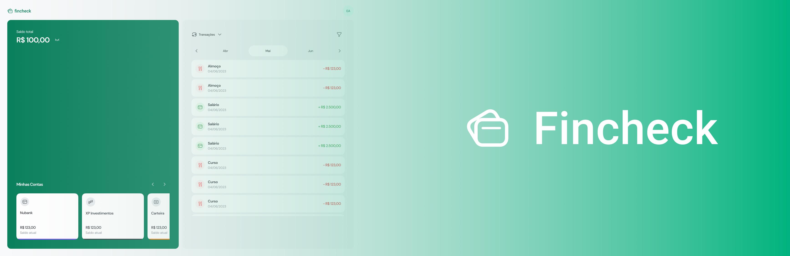

<p align="center">
  
</p>

<p align="center">
  <a href="#book-sobre-o-projeto">Sobre</a>&nbsp;&nbsp;&nbsp;|&nbsp;&nbsp;&nbsp;
  <a href="#pencil-funcionalidades">Funcionalidades</a>&nbsp;&nbsp;&nbsp;|&nbsp;&nbsp;&nbsp;
  <a href="#rocket-tecnologias">Tecnologias</a>&nbsp;&nbsp;&nbsp;|&nbsp;&nbsp;&nbsp;
  <a href="#computer-demo">Demo</a>&nbsp;&nbsp;&nbsp;|&nbsp;&nbsp;&nbsp;
  <a href="#eyes-preview">Preview</a>&nbsp;&nbsp;&nbsp;|&nbsp;&nbsp;&nbsp;
  <a href="#art-layout">Layout</a>&nbsp;&nbsp;&nbsp;|&nbsp;&nbsp;&nbsp;
  <a href="#fire-como-rodar-em-sua-maquina">Como Rodar</a>&nbsp;&nbsp;&nbsp;|&nbsp;&nbsp;&nbsp;
  <a href="#gear-como-contribuir">Contribuições</a>&nbsp;&nbsp;&nbsp;|&nbsp;&nbsp;&nbsp;
    <a href="#-licença">Licença</a>

</p>

---

<h1 align="center">
    
</h1>

# :book: Sobre o projeto
O Fincheck é a solução ideal para quem busca um controle eficiente e descomplicado das finanças pessoais. Esta aplicação intuitiva oferece uma maneira fácil de monitorar e gerenciar seus gastos diários. Com a capacidade de filtrar as despesas por conta, categoria e data, o Fincheck proporciona uma visão abrangente das suas finanças.

Com uma interface amigável, o Fincheck simplifica o processo de registro e categorização de despesas, permitindo que você mantenha o controle total sobre seus gastos. Seja para acompanhar as contas do mês, analisar padrões de consumo ou estabelecer metas financeiras, esta aplicação oferece as ferramentas necessárias para uma gestão financeira eficaz.

---

# :pencil: Funcionalidades
- [x] Cadastro, autenticação e recuperação de senha de usuários
- [x] Listagem, cadastro, atualização e remoção de contas bancárias
- [x]Listagem, cadastro, atualização e remoção de transações (receitas e despesas)

---

# :rocket: Tecnologias
Tecnologias utilizadas para desenvolver o projeto:

- [ReactJS](https://react.dev/)
- [Vite](https://vitejs.dev/)
- [Typescript](https://www.typescriptlang.org/)
- [TailwindCSS](https://tailwindcss.com/)
- [React Query](https://tanstack.com/query/)
- [React Hook Forms](https://react-hook-form.com/)
- [Zod](https://zod.dev/)
- [Radix UI](https://www.radix-ui.com/)
- [Headless UI](https://headlessui.com/)
- [Axios](https://axios-http.com/ptbr/docs/intro)
- [Swiper](https://swiperjs.com/)
- [React Hot Toast](https://react-hot-toast.com/)

---

# :computer: Demo
Deploy na [Vercel](df-fincheck.vercel.app/)

---

# :eyes: Preview
### Web Screenshot
<div>
   <p align="center">
       
       
   </p>
   <p align="center">
       
       
   </p>   
</div>

---

# :fire: Como rodar em sua maquina
## Você precisa já ter instalado 
- [Git](https://git-scm.com/)
- [NodeJS](https://nodejs.org/en/)
- Package manager ([NPM](https://www.npmjs.com/) ou [Yarn](https://yarnpkg.com/))

No seu terminal:
```bash
# Abra um terminal e copie este repositório com o comando
$ git clone https://github.com/DanielFariias/fincheck-fe.git

# Acesse a pasta do projeto no prompt de comando 
$ cd fincheck-fe

# Instale as dependências
yarn install
ou
$ npm install

# Rode o aplicação
$ yarn dev
ou
$ npm run dev

# Acesse http://localhost:3000 no seu navegador.
```

---

# :gear: Como contribuir
```bash
- Faça um fork desse repositório;
- Crie uma branch com a sua feature: git checkout -b minha-feature;
- Faça commit das suas alterações: git commit -m 'feat: Minha nova feature';
- Faça push para a sua branch: git push origin minha-feature;
```
---

# 📄 Licença

Esse projeto está sob a licença MIT. Veja o arquivo [LICENSE](LICENSE) para mais detalhes.

---

> Este projeto foi desenvolvido com ❤️ por **[Daniel Farias](https://github.com/DanielFariias)** <br> 
>Se te ajudou, dá ⭐, vai me ajudar também. 😉
